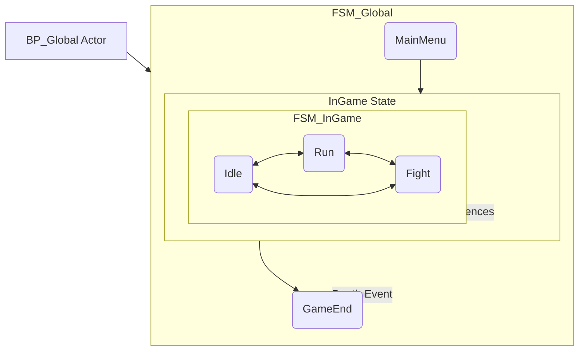

# StateMachineTutorial-UE5

> 课程《UE 5.6中有限状态机的使用》官方配套工程

本项目是B站课程 **《UE 5.6中有限状态机的使用》** 的配套教学工程。项目基于强大的 **Logic Driver Pro** 插件，在纯蓝图环境中，演示了如何运用**层次化状态机 (HFSM)** 来构建清晰、可扩展且易于维护的专业级游戏逻辑。

---

## 项目目标：告别“意大利面条”代码 (Project Goal)

你是否也曾被这样盘根错节的蓝图所困扰？

https://media.githubusercontent.com/media/michael-chen2010/StateMachineTutorial/refs/heads/main/pics/complexlogic.png

当角色的状态（如待机、跑动、攻击、受击、潜行）增多时，传统的布尔值和分支判断(Branch)会迅速失控，导致逻辑难以阅读、维护和扩展。

本项目旨在解决这一痛点，展示如何通过**状态机**这一优雅的设计模式，将混乱的逻辑重塑为清晰、模块化的结构。

---

## 核心概念 (Core Concepts)

本项目重点演示了状态机的两大核心思想：

### 1. 有限状态机 (Finite State Machine - FSM)
一切逻辑都围绕四个基本要素构建，形成一个清晰的闭环：
*   **现态 (Current State)**: 物体当前所处的状况 (e.g., `Idle`)。
*   **条件 (Condition / Transition)**: 触发状态变化的规则 (e.g., `When W key is pressed`)。
*   **动作 (Action)**: 在进入新状态或转换过程中执行的操作 (e.g., `Play Run Animation`)。
*   **次态 (Next State)**: 条件满足后进入的新状况 (e.g., `Run`)。

### 2. 层次化状态机 (Hierarchical FSM - HFSM)
当逻辑变得复杂时，HFSM通过“状态嵌套”来管理复杂性，**拒绝重复**。

**例如：** 如果角色在`Idle`, `Run`, `Fight`等任何状态下都可能死亡，扁平状态机需要从每个状态都连一条线到`Dead`状态。而使用HFSM，我们可以：
1.  将`Idle`, `Run`, `Fight`打包进一个名为`InGame`的父状态（或称“超级状态”）。
2.  只需从`InGame`父状态的边界创建一条到`GameEnd`状态的转换。
3.  这样，无论角色处于哪个子状态，死亡事件都能被这条共享的转换逻辑捕获，极大简化了设计。

---

## 项目架构解析 (Architecture)

为了聚焦核心，本项目采用了一个分层的状态机结构，由一个全局Actor进行驱动：

*   `BP_Global` (Actor): 放置在关卡中的全局管理器。它负责持有并运行**主状态机**，并作为事件中心向状态机广播游戏事件（如“玩家死亡”）。

*   `FSM_Global` (Logic Driver State Machine): 主状态机，负责管理游戏的顶层流程。
    *   `MainMenu` -> `InGame` -> `GameEnd`

*   `FSM_InGame` (Logic Driver State Machine): **子状态机**。它被`FSM_Global`中的`InGame`状态所引用，专门负责管理玩家在游戏内的具体行为逻辑。
    *   `Idle` -> `Run` -> `Fight`

这种**引用子状态机**的设计模式，让我们可以将复杂的行为逻辑分解到不同的、可复用的状态机蓝图中，保持主流程的整洁。

---

## 学习目标 (Learning Objectives)

通过探索和修改此项目，你将亲手实践：
1.  **熟悉项目结构**: 理解HFSM中父子状态机的协作方式。
2.  **添加新状态**: 在已有的`FSM_InGame`子状态机中，创建新的`Fight`状态。
3.  **设置转换条件**: 为`Idle`, `Run`, `Fight`之间添加双向转换逻辑。
4.  **实现状态动作**: 在每个状态的`On State Begin`事件中编写蓝图逻辑，通过改变角色颜色来直观地反馈当前状态。
5.  **验证HFSM优势**: 测试在`Idle`, `Run`, `Fight`任一状态下，触发“死亡”事件时，状态机都能正确地从`InGame`父状态跳转到`GameEnd`状态。

---

## 如何使用 (How to Use)

### 1. 环境与依赖

*   **Unreal Engine**: 5.6 (或兼容版本)
*   **必需插件**: [**Logic Driver Pro**](https://www.unrealengine.com/marketplace/en-US/product/logic-driver-pro)
    *   **注意**: Logic Driver Pro是一个**付费插件**，是运行本项目的**必要条件**。请确保你已从UE市场购买并安装了它。

### 2. 运行项目

1.  克隆或下载本仓库。
2.  确保已在引擎中启用`Logic Driver Pro`插件。
3.  使用Unreal Engine打开`StateMachineTutorial.uproject`文件。
4.  打开主关卡 (例如 `Content/Maps/MainLevel`)。
5.  点击 **运行 (Play)** 即可开始探索。

### 3. 调试技巧

*   **Print String**: 在状态的`On State Begin`或转换的`On Transition Taken`事件中打印日志，是简单有效的调试方法。
*   **Logic Driver调试器**: 在游戏运行时，打开状态机蓝图，插件会**实时高亮**当前激活的状态和最近经过的转换路径。这是进行可视化调试的超级利器！

---

## 核心资产文件 (Core Assets)

*   `Content/Blueprints/BP_Global`: 全局管理器Actor。
*   `Content/StateMachines/FSM_Global`: 主状态机。
*   `Content/StateMachines/FSM_InGame`: 核心玩法的子状态机，也是本次课程练习的主要操作对象。
*   `Content/Blueprints/BP_Character`: 实现了颜色变化逻辑的角色蓝图。

---

## 许可证 (License)

本项目采用 [MIT License](LICENSE)。
